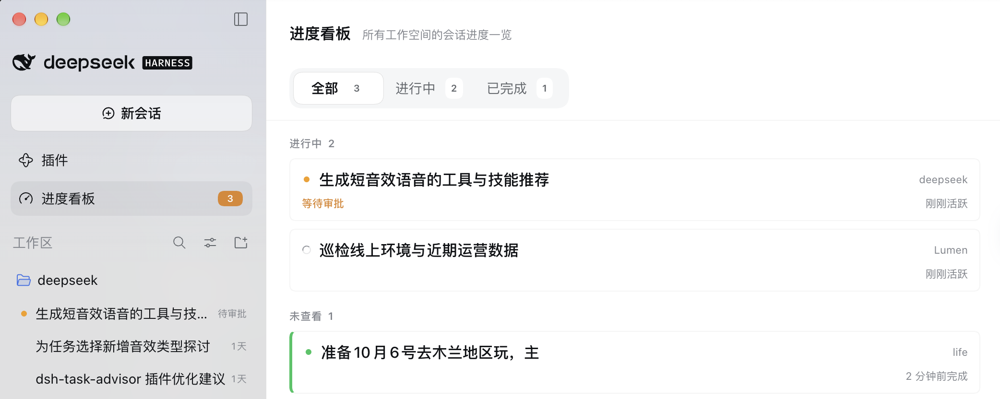

# dsh-ui-progress — Session Progress Board for DeepSeek Harness

English · [简体中文](README.md)

[](https://www.npmjs.com/package/dsh-ui-progress)
[](LICENSE)

A cross-workspace session progress board for the [DeepSeek Harness](https://github.com/deepseek-ai/deepseek-harness) web GUI. Adds a **Progress** entry to the sidebar — its badge counts sessions needing attention (running + unviewed completions) — opening a full-page board with **All** (default: running + unviewed completions only), **Running**, and **Done** sections, plus a workspace filter.



## What you get

- **Running** — every top-level session with live work. Sessions waiting on you (approval / question / plan review) sort first with an amber warning. Cards show the workspace chip, running-subagent count, and last-activity time.
- **Done** — sessions that finished while unselected stay on top until viewed (green marker); everything else flows into **Recently completed** (newest first, 10 shown with a *Show more* toggle).
- **Three-tone badge** — blue: work running only; green: unviewed completions waiting; amber: a session is waiting on you (highest priority).
- **Workspace filter** — one dropdown filters every section (including an *Ungrouped* bucket). It is a filter, not a third tab: the native sidebar already owns workspace-grouped browsing.
- Clicking a card opens the session directly (`ctx.uiWorkspace.openSession`).

Everything derives from root framework snapshots (`useSessions` / `useSessionStatus` / `useWorkspaces`) through a single pure projection (`deriveBoard`), so the badge and the page can never disagree. Completion history is viewing state persisted to `localStorage` (capped at 50 entries / 30 days), pruned when a session is archived or forgotten by the host.

## Install

**From npm (recommended)** — search `dsh-ui-progress` in the DeepSeek Harness plugin market, or via CLI:

```sh
dsh plugin --profile desktop add dsh-ui-progress
```

**From source** — clone and link:

```sh
git clone https://github.com/sdynasty/dsh-ui-progress.git
dsh plugin --profile desktop add link:<absolute path of the clone>
```

Refresh the web UI after installing; the **Progress** icon appears in the sidebar.

## Known limitations

- No todo/goal progress bars on cards yet: those facts are session-scoped and need a new `SessionProjectionMap` member on the host to reach a root-scope panel — the intended follow-up seam.
- Completion history lives in the browser's `localStorage`: it does not follow you across devices, and completions that happen while the client is closed are backfilled as *unviewed* at next launch.
- Pending-interaction kinds beyond `approval` / `question` / `plan-review` fall back to a generic "Action needed" label.

## Development

`src/` and `tests/` hold the full TypeScript + React sources, written to the dsh client-plugin conventions. `lib/` is the prebuilt artifact — no build is needed to install or use the plugin. To rebuild after changing the sources, see [BUILD.md](BUILD.md). The only externals of `lib/client.js` are host-baseline modules (`react`, `react/jsx-runtime`, `@deepseek-ai/dsh-client-ui-primitives`).

Issues and suggestions: [GitHub Issues](https://github.com/sdynasty/dsh-ui-progress/issues).

## License

[MIT](LICENSE) © sdynasty
